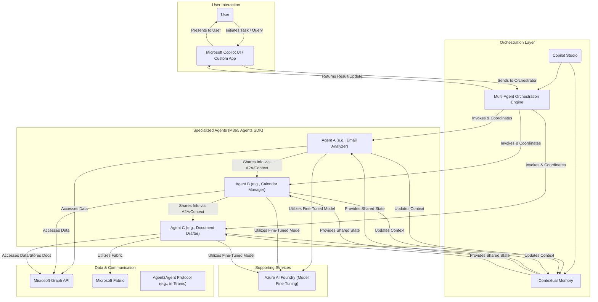

## Dream Weaving with AI: Architecting Multi-Agent Solutions with Copilot Studio & M365 Agents SDK

The air at Microsoft Build 2025 was thick with talk of an "age of AI agents," and for me, one of the most electrifying reveals was the focus on **multi-agent solutions**. The idea of individual AI agents collaborating, each with specialized skills, to tackle complex tasks across the Microsoft 365 ecosystem is no longer science fiction. With the significant enhancements to **Copilot Studio** for multi-agent orchestration and the power of the **Microsoft 365 Agents SDK**, we're now being handed the loom to weave these intricate AI tapestries.

As a developer and AI enthusiast always looking for ways to automate and innovate, I've been spending a lot of time mentally deconstructing how one might actually *architect* these multi-agent solutions. This isn't just about building a single chatbot; it's about designing a symphony of AI workers. Let's explore some initial thoughts and architectural considerations based on what we learned at Build.

### The Shift: From Soloist AI to an AI Orchestra

For a while, our primary interaction with AI has been with individual "soloist" models or bots. You ask a question, it gives an answer. You give a command, it performs a task. Multi-agent systems, however, are like an orchestra:

*   **Specialized Instruments (Agents):** Each agent can be designed with specific skills and access to particular data or tools (e.g., an "Email Summarizer Agent," a "Calendar Management Agent," a "Document Analysis Agent," a "Task Creation Agent").
*   **The Conductor (Orchestration Layer):** This is where Copilot Studio's new capabilities come in. It acts as the conductor, directing the flow of information and tasks between agents, ensuring they work in harmony.
*   **The Score (The User's Goal):** The overall objective the user wants to achieve, which might require the combined efforts of multiple agents.

This approach allows for much more sophisticated, nuanced, and powerful automation.

### Key Architectural Components (Based on Build 2025 Insights)

When I start thinking about designing a multi-agent solution for Microsoft 365, here are the key components and concepts I'd be considering, drawing heavily from the Build announcements:

1.  **Copilot Studio as the Central Hub:**
    *   **Role:** The primary interface for designing, configuring, and orchestrating the interactions between different AI agents.
    *   **Key Features to Leverage (from Build):**
        *   **Multi-Agent Orchestration Flows:** Visually (or programmatically) defining how agents hand off tasks, share context, and make decisions based on inputs from other agents or system events. The (hypothetical) "Advanced Agent Skill Composer" would be crucial here.
        *   **Trigger Management:** Defining what events (a new email, a specific phrase in a Teams chat, a calendar update) initiate a multi-agent workflow.
        *   **Contextual Memory Management:** Ensuring that relevant context is maintained and passed between agents as they collaborate on a task.
        *   **Connectivity:** Leveraging Copilot Studio's built-in connectors and the ability to call custom APIs (which could be our M365 agents).

2.  **Microsoft 365 Agents SDK for Specialized Skills:**
    *   **Role:** To build the individual, specialized "worker" agents that perform specific tasks within the M365 ecosystem. These are the "instruments" in our orchestra.
    *   **Key Features to Leverage (from Build):**
        *   **Deep M365 Data Access:** Using the M365 Copilot APIs (like the Retrieval API) to allow agents to securely access and reason over relevant Microsoft Graph data (emails, files, calendars, contacts).
        *   **Custom Logic & Business Rules:** Implementing the core intelligence and specific business logic for each agent's specialization.
        *   **Scalability & Enterprise-Grade Build:** Developing robust, secure, and scalable agents that can handle real-world enterprise demands.
        *   **Integration with Azure AI Foundry:** Potentially using Azure AI Foundry to fine-tune models that power these specialized M365 agents, making them even more effective.

3.  **The Data Layer (Microsoft Graph & Beyond):**
    *   **Role:** Providing the rich, contextual information that agents need to operate effectively.
    *   **Considerations:**
        *   **Microsoft Graph:** The primary source for user-specific data within M365.
        *   **Microsoft Fabric:** For agents needing to access and reason over broader operational and analytical datasets.
        *   **External Data Sources:** Agents might also need to securely access data from third-party systems via APIs.

4.  **Communication Protocols (Agent2Agent - A2A):**
    *   **Role:** Enabling direct, efficient communication and collaboration between agents, especially within environments like Microsoft Teams.
    *   **Considerations (from Build):** The new A2A protocol announced for Teams will likely be a key enabler for more fluid inter-agent dialogues and task handoffs.

5.  **User Interface & Interaction Points:**
    *   **Role:** How will users initiate multi-agent tasks and receive results or updates?
    *   **Considerations:**
        *   **Microsoft Copilot:** The primary user-facing interface for many scenarios.
        *   **Custom Applications:** Agents might be surfaced through custom web apps, mobile apps, or directly within M365 applications.
        *   **Proactive Agents:** Some agents might operate in the background, triggered by events, and only notify the user when action is required or a task is complete.

### Designing a Sample Multi-Agent Workflow

Let's imagine a (simplified) workflow: **"Help me prepare for my upcoming project review meeting."**

1.  **User Input:** User tells Microsoft Copilot, "Help me prepare for my Project Phoenix review next Tuesday."
2.  **Copilot Studio (Orchestrator):**
    *   Identifies the intent: "meeting preparation."
    *   Extracts entities: "Project Phoenix," "next Tuesday."
    *   Invokes **Agent A (Calendar/Email Agent - built with M365 Agents SDK):**
        *   Task: Find the "Project Phoenix review" meeting on the calendar for next Tuesday. Identify attendees.
        *   Task: Search recent emails related to "Project Phoenix" for key updates or action items.
        *   Returns: Meeting details, key attendees, and summarized email highlights to Copilot Studio.
3.  **Copilot Studio (Orchestrator):**
    *   Receives info from Agent A.
    *   Invokes **Agent B (Document Retrieval Agent - built with M365 Agents SDK):**
        *   Task: Based on "Project Phoenix" and attendee names, search SharePoint/OneDrive for relevant documents (status reports, presentations, planning docs).
        *   Returns: Links to top 3-5 relevant documents to Copilot Studio.
4.  **Copilot Studio (Orchestrator):**
    *   Receives info from Agent B.
    *   Invokes **Agent C (Summarization/Action Item Agent - potentially leveraging Azure AI or a fine-tuned model):**
        *   Task: Summarize the key points from the documents provided by Agent B and the email highlights from Agent A. Identify any outstanding action items.
        *   Returns: A concise briefing document to Copilot Studio.
5.  **Copilot Studio (Orchestrator):**
    *   Compiles all information (meeting details, relevant docs, briefing summary).
    *   Presents a consolidated "Meeting Prep Pack" back to the user via the Copilot interface.

This is just one example, but it illustrates how different specialized agents can collaborate, orchestrated by Copilot Studio, to achieve a complex user goal.

### Key Architectural Principles I'd Keep in Mind

*   **Modularity & Specialization:** Design agents to do one thing (or a small set of related things) well. This makes them easier to build, test, and maintain.
*   **Clear Interfaces & Contracts:** Define how agents will communicate and what data they expect/return.
*   **Context Management:** Think carefully about how context is passed and maintained across agent interactions.
*   **Error Handling & Resilience:** What happens if one agent in the chain fails? The orchestrator needs to handle this gracefully.
*   **Security & Permissions:** Agents must operate within the user's security context and only access data they are authorized to see. The M365 Agents SDK and Graph APIs are designed with this in mind.
*   **Observability & Monitoring:** As highlighted at Build, having tools to monitor and debug agent interactions will be crucial.
*   **Responsible AI:** Build with fairness, transparency, and human oversight in mind from the outset.

### The Exciting Road Ahead

The announcements from Microsoft Build 2025 have laid a remarkable foundation. Architecting these multi-agent solutions will be a new frontier for many developers, including myself. It will require a shift in thinking from building monolithic applications or single-purpose bots to designing ecosystems of collaborative AI.

I'm incredibly excited to start experimenting with Copilot Studio's orchestration features and the M365 Agents SDK to see what kind of intelligent automation we can bring to life. The potential to streamline complex workflows and truly augment human productivity in Microsoft 365 is immense.

What kind of multi-agent solutions are you dreaming up? What challenges and opportunities do you foresee? Let's discuss in the comments!