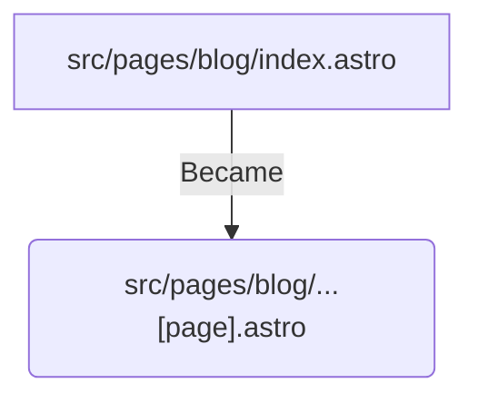
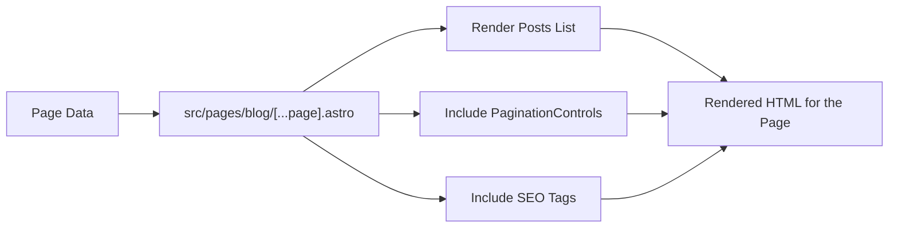

## Taming the Content Beast: My Journey Implementing Pagination in My Astro Blog

As Domdhi.com, my personal AI Hub, started to grow with more articles on AI tools, coding adventures, and creative experiments, I quickly ran into a common "good problem to have": a growing list of blog posts! While exciting, I realized that just dumping all articles onto a single page was becoming unwieldy. Users would face an endless scroll, and site performance could eventually take a hit. It was time to implement a proper pagination system.

I wanted something robust, user-friendly, and importantly, SEO-friendly. Luckily, Astro, the framework I use for Domdhi.com, has some fantastic built-in capabilities that make this process smoother than I initially anticipated. So, I want to walk you through how I tackled this, sharing my steps and learnings along the way.

### Why Pagination Became a Priority for Domdhi.com

Before diving into the "how," let's touch on the "why." For a content-heavy site like a blog, pagination offers several crucial benefits:

*   **Improved User Experience:** Let's be honest, no one wants to scroll through hundreds of posts. Breaking content into manageable pages (e.g., 10 posts per page) makes browsing much easier and less overwhelming.
*   **Better Performance:** Loading fewer posts at a time means faster initial page loads and less data for the user to download. This is key for keeping visitors engaged.
*   **Enhanced SEO:** When done right, pagination helps search engines understand the structure of your blog, discover all your content, and index it effectively. Proper use of `rel="next"` and `rel="prev"` links is vital here.

I knew that getting this right would be essential for both my readers and for making sure search engines could easily find all the AI insights I'm sharing.

### Astro's Superpowers for Pagination

Astro comes equipped with some powerful features that are tailor-made for pagination:

*   **Dynamic Routes:** Astro's file-based routing is super flexible. We can create routes like `src/pages/blog/[...page].astro` that can dynamically handle different page numbers (e.g., `/blog/1`, `/blog/2`, etc.).
*   **`getStaticPaths` Function:** This is the heart of static site generation with dynamic routes. It tells Astro which paths to pre-render at build time. For pagination, this means generating each numbered page of our blog.
*   **The `paginate()` Helper:** This is Astro's magic wand for pagination. You give it your full list of items (like all my blog posts) and tell it how many items you want per page. It then automatically generates all the necessary data and URL information for each page.

With these tools at my disposal, I felt confident I could build a solid solution.

### My Step-by-Step Implementation Journey

Here's how I integrated pagination into the Domdhi.com blog:

#### 1. Restructuring for Paginated Routes and Fetching Data

My first step was to adapt my existing blog listing page to handle multiple pages.

**File Structure Change:**
Previously, I might have had a single `src/pages/blog/index.astro` to list all posts. For pagination, this needed to become a dynamic route.


This change allows Astro to generate `/blog/`, `/blog/2/`, `/blog/3/`, and so on.

**Implementing `getStaticPaths`:**
Inside this new `src/pages/blog/[...page].astro` file, I implemented the `getStaticPaths` function. This is where Astro's `paginate()` helper comes into play.

```astro
// src/pages/blog/[...page].astro
---
import type { Page, GetStaticPathsOptions } from "astro";
import type { CollectionEntry } from "astro:content"; // Assuming I use Astro Content Collections
import { getCollection } from "astro:content";
import BaseLayout from "../../layouts/BaseLayout.astro"; // My base layout
import PostCard from "../../components/PostCard.astro"; // My component for displaying a single post

export async function getStaticPaths({ paginate }: GetStaticPathsOptions) {
  // Fetch all my blog posts from the "blog" collection
  const allPosts = await getCollection("blog", ({ data }) => {
    // Filter out drafts or posts without a date if needed
    return import.meta.env.PROD ? data.draft !== true : true;
  });

  // Always good to sort posts, typically newest first
  allPosts.sort((a, b) => new Date(b.data.date).valueOf() - new Date(a.data.date).valueOf());

  const pageSize = 10; // I decided on 10 posts per page for Domdhi.com

  // Let Astro do the pagination magic!
  return paginate(allPosts, { pageSize });
}

// The `page` prop is automatically injected by `paginate`
// It contains the data for the current page and pagination metadata
interface Props {
  page: Page<CollectionEntry<"blog">>;
}
const { page } = Astro.props as Props;

// Now, `page.data` holds the array of posts for this specific page.
// We also get `page.currentPage`, `page.totalPages`, `page.url.prev`, `page.url.next`, etc.
---
<BaseLayout title={`Blog - Page ${page.currentPage} | Domdhi.com`} description={`Browse articles from the Domdhi.com AI Hub - Page ${page.currentPage}.`}>
  <section class="container mx-auto py-8 px-4">
    <h1 class="text-4xl font-bold mb-8 text-theme-text-accent">Domdhi Blog - Page {page.currentPage}</h1>
    <div class="grid grid-cols-1 md:grid-cols-2 lg:grid-cols-3 gap-8">
      {page.data.map((post) => (
        <PostCard post={post} />
      ))}
    </div>
    {/* Pagination controls will go here */}
  </section>
</BaseLayout>
```
This setup fetches all my blog posts, sorts them by date, and then `paginate()` slices them into pages. The component then receives a `page` prop that's packed with useful information.

#### 2. Crafting a Reusable Pagination UI Component

To display the "Previous" / "Next" links and page numbers, I created a dedicated `PaginationControls.astro` component. This keeps my main page template cleaner.

```astro
// src/components/PaginationControls.astro
---
import type { Page } from "astro";
// I might use CollectionEntry<"blog"> or make it more generic with Page<any>
import type { CollectionEntry } from "astro:content"; 

interface Props {
    page: Page<CollectionEntry<"blog">>;
}

const { page } = Astro.props;

const currentPage = page.currentPage;
const totalPages = page.lastPage; // `lastPage` is a handy alias for totalPages
const prevUrl = page.url.prev;
const nextUrl = page.url.next;

// My site's theme colors for styling
const themeClasses = {
    link: "px-4 py-2 border border-theme-border rounded-md text-theme-text hover:bg-theme-accent hover:text-theme-accent-text hover:border-theme-accent transition-colors duration-200",
    disabled: "px-4 py-2 border border-theme-border rounded-md text-theme-muted cursor-not-allowed opacity-50",
    currentPage: "text-theme-text font-semibold"
};
---

{totalPages > 1 && (
    <nav
        aria-label="Blog post pagination"
        class="flex justify-center items-center space-x-2 sm:space-x-4 my-12"
    >
        {prevUrl ? (
            <a
                href={prevUrl}
                class={themeClasses.link}
                aria-label="Go to previous page"
            >
                &laquo; Previous
            </a>
        ) : (
            <span
                class={themeClasses.disabled}
                aria-disabled="true"
            >
                &laquo; Previous
            </span>
        )}

        <span class={themeClasses.currentPage}>
            Page {currentPage} of {totalPages}
        </span>

        {nextUrl ? (
            <a
                href={nextUrl}
                class={themeClasses.link}
                aria-label="Go to next page"
            >
                Next &raquo;
            </a>
        ) : (
            <span
                class={themeClasses.disabled}
                aria-disabled="true"
            >
                Next &raquo;
            </span>
        )}
    </nav>
)}
```
This component is pretty straightforward:
*   It receives the `page` object.
*   Conditionally renders "Previous" and "Next" links. If `prevUrl` or `nextUrl` doesn't exist (meaning you're on the first or last page), it shows a disabled-looking span.
*   Displays "Page X of Y".
*   I used some Tailwind CSS classes (via my `themeClasses` object for consistency) to style it nicely.
*   It only renders if there's more than one page.

#### 3. Integrating the Controls into the Blog Page

Next, I simply imported and used my `PaginationControls` component in the `src/pages/blog/[...page].astro` file, typically after the list of posts.

```astro
// src/pages/blog/[...page].astro
---
// ... (frontmatter from Step 1, including `getStaticPaths` and `page` prop) ...
import PaginationControls from "../../components/PaginationControls.astro"; // Import the component
---
<BaseLayout title={`Blog - Page ${page.currentPage} | Domdhi.com`} 
description={`Browse articles from the Domdhi.com AI Hub - Page ${page.currentPage}.`}>
  <section class="container mx-auto py-8 px-4">
    <h1 class="text-4xl font-bold mb-8 text-theme-text-accent">Domdhi AI Hub - Blog</h1>
    <p class="text-lg text-theme-muted mb-10">Page {page.currentPage} of {page.totalPages}</p>
    <div class="grid grid-cols-1 md:grid-cols-2 lg:grid-cols-3 gap-8">
      {page.data.map((post) => (
        <PostCard post={post} />
      ))}
    </div>

    {/* Here come the pagination controls! */}
    <PaginationControls page={page} />
  </section>
</BaseLayout>
```
And just like that, the pagination UI appears!

#### 4. Crucial SEO Enhancements: `rel="prev"` and `rel="next"`

This step is vital for SEO. Search engines need to understand the relationship between your paginated pages. We achieve this by adding `<link rel="prev" href="...">` and `<link rel="next" href="...">` tags to the `<head>` of each page.



I added these directly in the `<head>` section of my `src/pages/blog/[...page].astro` file (or more likely, I'd pass `page.url.prev` and `page.url.next` to my `BaseLayout` which then passes them to my `SEO.astro` component to handle).

```astro
// src/pages/blog/[...page].astro
---
// ... (frontmatter, including page prop) ...
const { page } = Astro.props as Props;
const seoProps = {
    title: `Blog - Page ${page.currentPage} | Domdhi.com`,
    description: `Browse articles from the Domdhi.com AI Hub - Page ${page.currentPage}.`,
    // Pass prev/next URLs to the layout/SEO component
    prevUrl: page.url.prev,
    nextUrl: page.url.next,
    canonical: Astro.url.href // Canonical for paginated pages is the page itself
};
---
<BaseLayout {...seoProps}>
    {/* ... rest of the page content ... */}
    <PaginationControls page={page} />
</BaseLayout>
```
And then in my `SEO.astro` (or `BaseHead.astro`):
```astro
// Conceptual addition to SEO.astro or BaseHead.astro
---
// Props would include prevUrl?: string; nextUrl?: string;
const { prevUrl, nextUrl /* ... other SEO props */ } = Astro.props;
---
{/* ... other meta tags ... */}
{prevUrl && <link rel="prev" href={prevUrl} />}
{nextUrl && <link rel="next" href={nextUrl} />}
```
This ensures that:
*   Page 1 only has a `rel="next"` link (if a page 2 exists).
*   Middle pages have both `rel="prev"` and `rel="next"` links.
*   The last page only has a `rel="prev"` link (if it's not page 1).

### Testing My New Pagination Rigorously

With everything in place, thorough testing was key:

1.  **Different Content Counts:** I tested how it handled scenarios with fewer posts than my `pageSize` (10), exactly 10 posts, and various numbers of posts that would result in multiple pages.
2.  **Navigation:** Clicking "Previous" and "Next" through all available pages.
3.  **Content Accuracy:** Double-checking that the correct set of posts appeared on each respective page.
4.  **Edge Cases:** Ensuring "Previous" was correctly disabled (stylistically and functionally) on page 1, and "Next" on the last page.
5.  **SEO Tag Validation:** Using browser developer tools to inspect the `<head>` on different pages to confirm the `rel="prev"` and `rel="next"` tags were correctly implemented and pointing to the right URLs.
6.  **Styling & Responsiveness:** Making sure my pagination controls looked good and worked well on different screen sizes.

### The Rewarding Outcome

Implementing this pagination system in Astro was a genuinely satisfying experience. Thanks to Astro's well-thought-out `paginate()` helper and its component-based structure, what could have been a complex task turned into a pretty streamlined process.

Now, visitors to Domdhi.com can browse through my AI discoveries and coding adventures much more easily, and I have peace of mind knowing that search engines can efficiently crawl and index all my content. If your Astro blog is growing, I highly recommend implementing a similar pagination strategy – your users (and your SEO) will thank you!

Have you tackled pagination in Astro or another framework? Any tips or tricks you learned along the way? I'd love to hear about your experiences in the comments!