## My Full AI Image Workflow

Ever since I dived headfirst into the world of AI image generation, I've been absolutely captivated. The ability to translate a fleeting thought, a vivid dream, or a complex concept into a visual reality is nothing short of magic! But like any creative endeavor, there's a process behind the "Aha!" moment. Today, I want to pull back the curtain and share my personal end-to-end workflow for creating AI images. It's a journey from the initial spark of an idea to the final polished piece.

My workflow is always evolving as I learn and new tools emerge, but this is the framework I generally follow. Hopefully, it gives you some insights or inspires you to refine your own creative process!

### Phase 1: The Idea - Where Inspiration Strikes

Everything starts with an idea, right? For me, inspiration can come from anywhere:
*   A line from a song or book.
*   A dream I vaguely remember.
*   Observing patterns in nature or architecture.
*   Even just seeing other amazing AI art and thinking, "What if...?"

I try to capture these fleeting thoughts immediately. I use a simple notes app on my phone, a physical sketchbook if I'm feeling analog, or sometimes even a private Pinterest board to collect visual moods. The key at this stage isn't to have a fully formed prompt, but to nail down the core concept or feeling I want to evoke.

For instance, I might jot down "ethereal jellyfish floating through a neon-drenched cyberpunk city" or "a wise old tree with glowing runes, style of Studio Ghibli."

### Phase 2: Choosing the Right AI Tool (or Tools!)

Once I have a concept, I think about which AI image generator will best bring it to life. There's a fantastic array of tools out there, each with its strengths:

*   **Midjourney:** I often lean on Midjourney for its artistic flair, cinematic quality, and ability to interpret more abstract prompts beautifully. Its Discord-based interface is unique but powerful once you get the hang of it.
*   **Stable Diffusion (local or cloud):** For more control, fine-tuning, and the ability to use specific models (LoRAs, checkpoints), Stable Diffusion is my go-to. Running it locally gives me ultimate freedom, but cloud versions are great for accessibility.
*   **DALL-E 3 (via ChatGPT or Bing Image Creator):** I find DALL-E 3 excellent for more illustrative styles, photorealism with specific details, and its ability to understand natural language prompts incredibly well.
*   **Other specialised tools:** Sometimes a project might call for something more niche, like an AI for specific patterns or abstract art.

My choice often depends on the desired style, level of detail, and how much control I want over the generation process. Sometimes, I even use multiple tools – generating a base in one and then using another for variations or upscaling.

```mermaid
graph TD
    subgraph AI Image Generators
        A["Midjourney"]
        B["Stable Diffusion"]
        D["DALL-E"]
    end

    C(("💡 <br/> Your Idea"))

    A -- Generates visuals for --> C
    B -- Generates visuals for --> C
    D -- Generates visuals for --> C
```

<!--  -->
<!-- *(Imagine a simple diagram here showing logos of Midjourney, Stable Diffusion, DALL-E with arrows pointing to "Your Idea")* -->

### Phase 3: Crafting the Perfect Prompt - The Art and Science

This is where the real fun (and sometimes frustration!) begins. Prompting is an art form in itself. My general approach is to start somewhat broad and then layer in details. A typical prompt structure I use might include:

1.  **Subject:** The main focus of the image. (e.g., "A majestic phoenix...")
2.  **Action/Setting:** What the subject is doing and where. (e.g., "...soaring over a volcanic landscape...")
3.  **Style/Artist Influence:** The aesthetic I'm aiming for. (e.g., "...in the style of a fantasy concept art, inspired by Brom and Frank Frazetta...")
4.  **Medium/Technique:** (e.g., "...digital painting, highly detailed, cinematic lighting...")
5.  **Atmosphere/Mood:** (e.g., "...epic, dramatic, fiery glow...")
6.  **Composition/Framing:** (e.g., "...dynamic angle, wide shot...")
7.  **Color Palette:** (e.g., "...warm color palette, deep reds, oranges, and blacks.")
8.  **Negative Prompts (if supported):** Things to avoid. (e.g., `--no blurry, poorly drawn hands, text`)

So, a more complete prompt might look like:
`A majestic phoenix, fiery feathers, soaring over a craggy volcanic landscape during an eruption, style of fantasy concept art, inspired by Brom and Frank Frazetta, digital painting, highly detailed, cinematic lighting, dramatic atmosphere, epic, dynamic angle, wide shot, warm color palette with deep reds, oranges, and blacks --ar 16:9 --no blurry, text, watermark`

I rarely get the perfect image on the first try. Prompting is iterative!

### Phase 4: Generation and Iteration - The Fun Part!

With my initial prompt ready, I hit "generate" and watch the magic happen. The first batch of images gives me valuable feedback.
*   Are they close to my vision?
*   What did the AI misinterpret?
*   What elements are working well?

Then, I iterate:
*   **Refine the Prompt:** Add more detail, remove conflicting terms, try different keywords for style or lighting.
*   **Vary Seeds:** Most tools allow you to use the same seed with slight prompt modifications to see variations on a theme.
*   **Use Tool-Specific Features:**
    *   In Midjourney, I use the `V` buttons for variations, `U` buttons for upscaling, and the pan/zoom/vary (region) features extensively.
    *   In Stable Diffusion, I might experiment with different samplers, CFG scale, or use image-to-image (img2img) with a rough sketch or a previous generation.
*   **Change Aspect Ratio:** Sometimes, simply changing the aspect ratio (e.g., from square `1:1` to widescreen `16:9`) can dramatically alter the composition for the better.

This is a loop: generate, evaluate, refine, repeat. It's not uncommon for me to go through dozens of iterations before I land on something I'm truly happy with.

*(Imagine a 2x2 grid here showing an initial generation and then 3 improved iterations based on prompt tweaks)*

### Phase 5: Refining and Upscaling - Adding the Polish

Once I have a generated image that I love, it's time for the finishing touches.

*   **Upscaling:** Most AI generators produce images at a decent resolution, but for printing or detailed viewing, I'll upscale them. Tools like Gigapixel AI, Topaz Photo AI, or even built-in upscalers within the AI platforms (like Midjourney's `U` buttons or Stable Diffusion's upscaling scripts) do a fantastic job of increasing resolution while often enhancing detail.
*   **Minor Edits:** I often bring the upscaled image into a traditional photo editor like Adobe Photoshop, GIMP (free & open-source), or Photopea (free web-based). Here, I might:
    *   Adjust brightness, contrast, and colors.
    *   Sharpen specific areas.
    *   Fix tiny artifacts or glitches the AI might have introduced.
    *   Use content-aware fill or inpainting (sometimes AI-assisted within these tools too!) to correct small imperfections.

The goal here isn't to fundamentally change the AI's creation but to enhance it and ensure it looks its absolute best.

### Phase 6: The Final Touches and Sharing

With the image refined and looking sharp, I do a final once-over. Then, it's about:

*   **Organizing:** I'm trying to be better at this! I save my final images, often with the prompt or key parameters in the filename or metadata, so I can refer back to them.
*   **Sharing (Responsibly):** I love sharing my creations! Whether it's on social media, dedicated AI art platforms, or right here on Domdhi.com. When I share, I always try to be transparent that it's AI-generated, and if I've used particular artist names for style inspiration in my prompt, I often mention them too as a nod to their influence.

### It's Your Turn to Create!

And that's pretty much my current AI image workflow! It sounds like a lot of steps, but once you get into a rhythm, it becomes quite intuitive and incredibly rewarding. The beauty of AI is that it's a constantly evolving landscape, so this workflow will undoubtedly adapt as new tools and techniques emerge.

The most important thing is to experiment, have fun, and find a process that works for you. Don't be afraid to break the "rules" and try unconventional approaches. That's often where the most exciting discoveries are made!

What does your AI image workflow look like? Do you have any favorite tools or tricks you'd like to share? I'd love to hear about your experiences in the comments below! Happy creating!